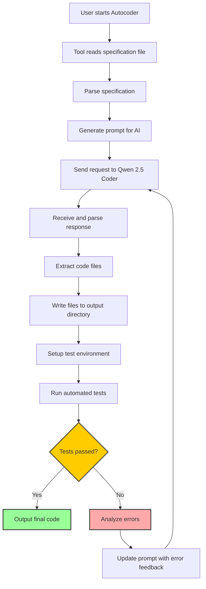
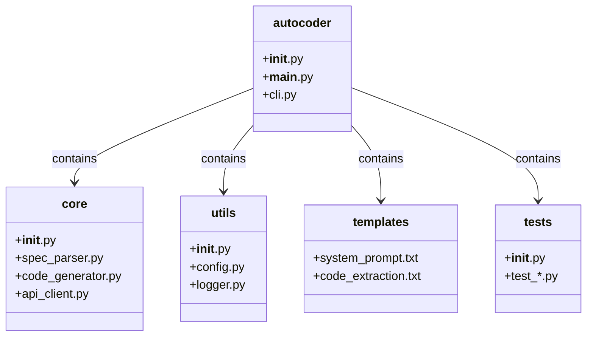

# Autocoder

An AI-powered command-line tool for automatic code generation, testing, and validation using the Qwen 2.5 Coder model.

## Features

- Command-line interface for easy use
- Automatic code generation from software development specifications
- Automatic test creation and execution
- Self-validation and error correction
- Code analysis and understanding
- Code refactoring and optimization
- Error diagnostics
- Integration with version control systems
- Interactive development mode
- Multi-language support

## Workflow Diagram



## Project Structure



## Installation

```bash
# Clone the repository
git clone https://github.com/vollocare/autocoder.git
cd autocoder

# Install the package
pip install -e .
```

## Requirements

- Python 3.9+
- NVIDIA GPU with at least 24GB VRAM for INT8 quantized model (60GB for full model)
- CUDA support
- At least 8GB RAM (16GB+ recommended)

## Configuration

Autocoder uses a configuration file named `.autocoder.yaml` located in the current directory or home directory. Here's a sample configuration:

```yaml
model:
  api_endpoint: "http://localhost:11434/v1"
  temperature: 0.6
  top_p: 0.9
  max_tokens: 8192
  quantize: "none"
  system_prompt: "You are an expert Python developer tasked with generating high-quality, maintainable code based on detailed specifications."

max_test_iterations: 3
verbose: true
colors_enabled: true
```

## Usage

```bash
# Display help
autocoder --help

# Generate code from a specification file
autocoder generate <spec_path> [--output-dir <output_directory>]

# Understand existing code
autocoder understand <code_path> [--output-file <output_file>]

# Refactor code
autocoder refactor <code_path> [--target <target>] [--output-dir <output_directory>]

# Generate and run tests
autocoder test <code_path> [--output-dir <output_directory>]

# Start interactive development mode
autocoder interactive

# Configure model settings
autocoder config --model <model_path> --api <api_endpoint>
# List current configuration
autocoder config --list
```

For detailed command-line help, see [CLI_HELP.md](docs/CLI_HELP.md).

### Command Options

- `--output-dir`, `-o`: Specify output directory (will be created if it doesn't exist)
- `--verbose`, `-v`: Enable verbose output
  - Shows environment information (Python version, OS, working directory)
  - Displays configuration details (API endpoint, temperature, etc.)
  - Shows all executed commands and their complete output
  - Provides detailed execution time statistics
  - Displays command execution history
- `--quiet`, `-q`: Minimize output
- `--no-color`: Disable colored output
- `--temperature`: Set model temperature (0.0-1.0, default 0.6)
- `--top-p`: Set model diversity (0.0-1.0, default 0.9)
- `--max-tokens`: Set maximum generation tokens (default 8192)
- `--quantize`: Select quantization level (none/int8/int4)
- `--system-prompt`: Use custom system prompt
- `--seed`: Set random seed for consistent results
- `--yes`: Automatically confirm operations

## Core Components

- **CLI (cli.py)**: Command-line interface and entry point
- **SpecificationParser (spec_parser.py)**: Parses specification files
- **CodeGenerator (code_generator.py)**: Generates code from specifications
- **APIClient (api_client.py)**: Communicates with Qwen 2.5 Coder model API
- **Config (config.py)**: Manages configuration settings
- **Logger (logger.py)**: Handles log messages and output formatting

## License

MIT

## Acknowledgements

This project utilizes the Qwen 2.5 Coder 32B model. 