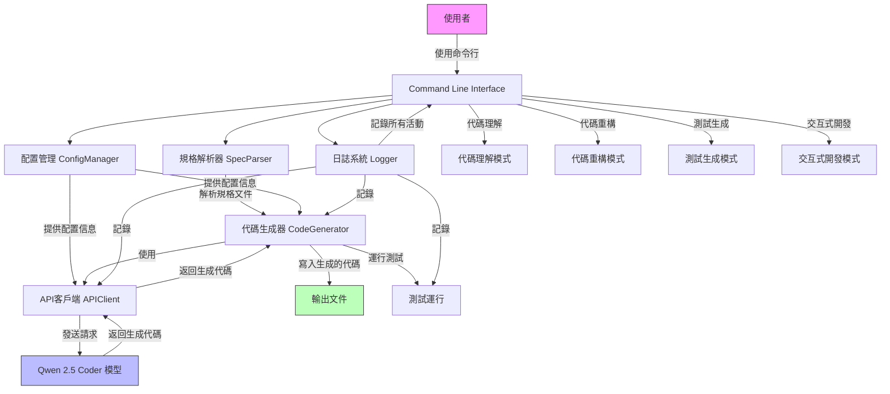
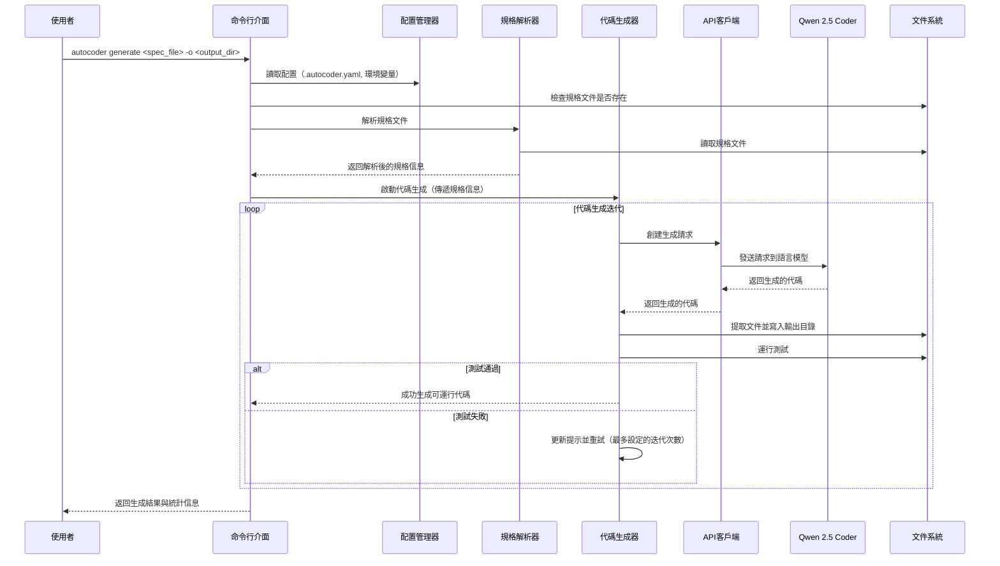
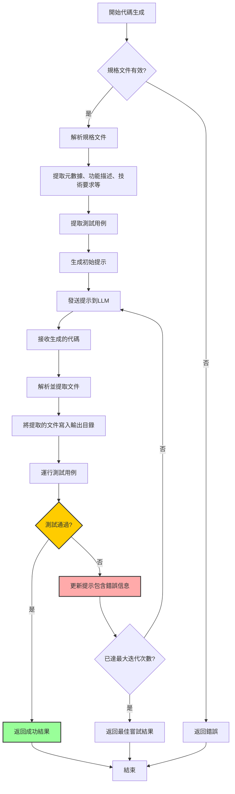
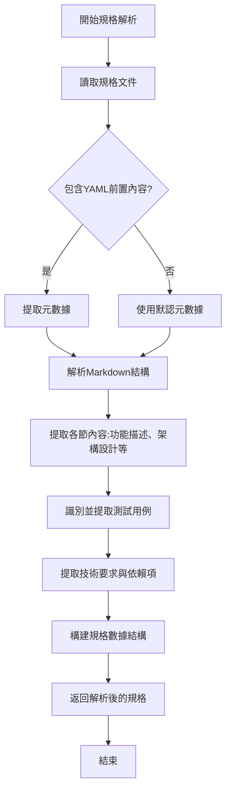
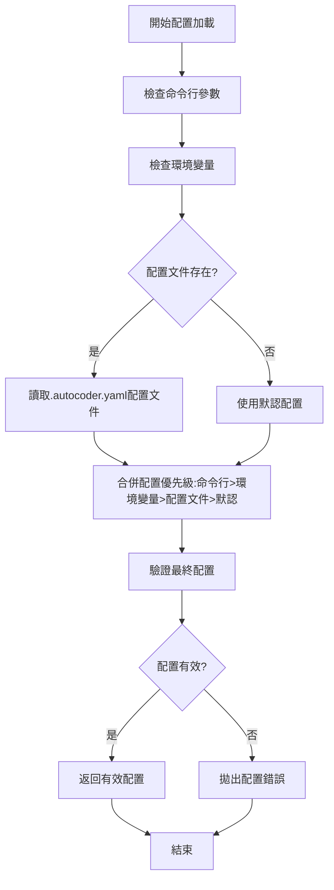
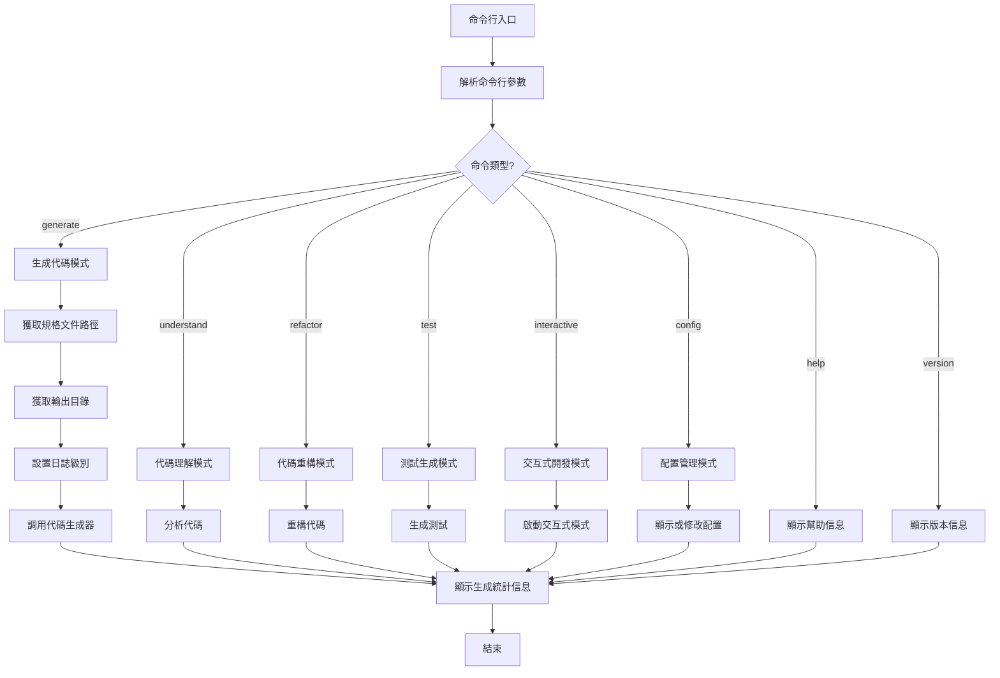
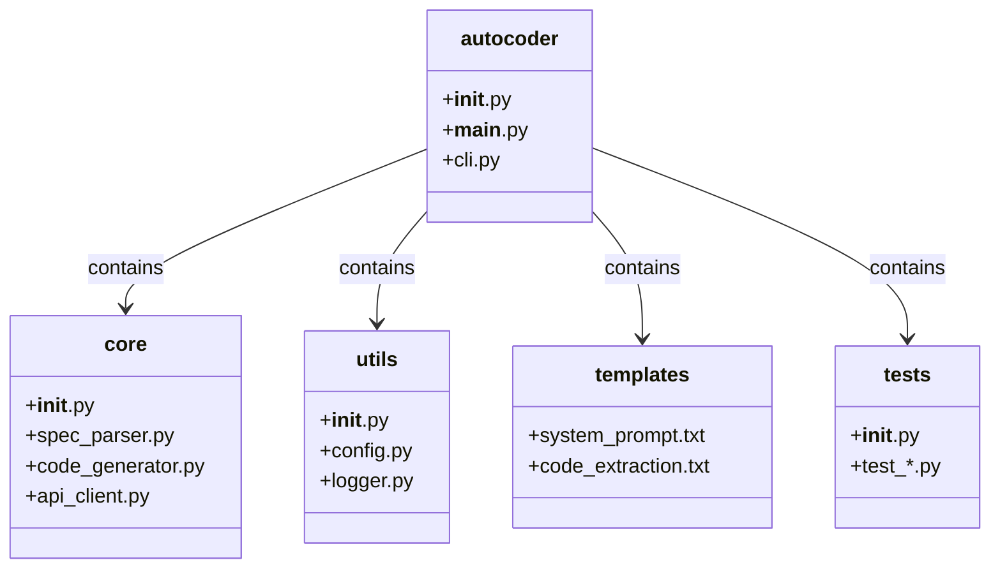
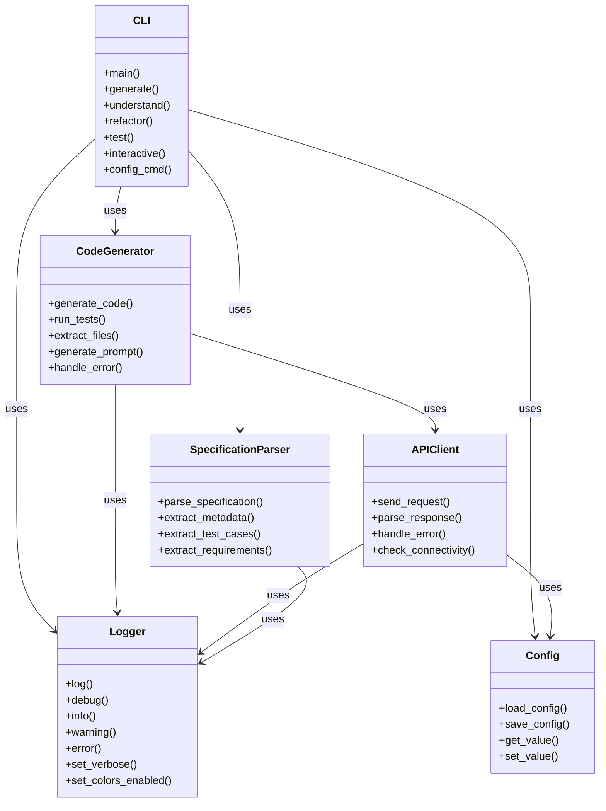

# Autocoder 架構與流程圖

## 系統架構圖

```mermaid
graph TD
    User[使用者] -->|使用命令行| CLI[Command Line Interface]
    CLI --> Spec[規格解析器 SpecParser]
    CLI --> Config[配置管理 ConfigManager]
    CLI --> Logger[日誌系統 Logger]
    
    Spec -->|解析規格文件| CodeGen[代碼生成器 CodeGenerator]
    Config -->|提供配置信息| CodeGen
    Config -->|提供配置信息| API[API客戶端 APIClient]
    
    CodeGen -->|使用| API
    API -->|發送請求| LLM[Qwen 2.5 Coder 模型]
    LLM -->|返回生成代碼| API
    API -->|返回生成代碼| CodeGen
    
    CodeGen -->|寫入生成的代碼| Output[輸出文件]
    CodeGen -->|運行測試| Tests[測試運行]
    
    Logger -->|記錄所有活動| CLI
    Logger -->|記錄| CodeGen
    Logger -->|記錄| API
    Logger -->|記錄| Tests

    CLI -->|代碼理解| Understand[代碼理解模式]
    CLI -->|代碼重構| Refactor[代碼重構模式]
    CLI -->|測試生成| TestGen[測試生成模式]
    CLI -->|交互式開發| Interactive[交互式開發模式]
    
    style User fill:#f9f,stroke:#333,stroke-width:1px
    style LLM fill:#bbf,stroke:#333,stroke-width:1px
    style Output fill:#bfb,stroke:#333,stroke-width:1px
```

## 執行流程圖

```mermaid
sequenceDiagram
    participant User as 使用者
    participant CLI as 命令行介面
    participant Config as 配置管理器
    participant Spec as 規格解析器
    participant CodeGen as 代碼生成器
    participant API as API客戶端
    participant LLM as Qwen 2.5 Coder
    participant File as 文件系統
    
    User->>CLI: autocoder generate <spec_file> -o <output_dir>
    CLI->>Config: 讀取配置（.autocoder.yaml, 環境變量）
    CLI->>File: 檢查規格文件是否存在
    CLI->>Spec: 解析規格文件
    
    Spec->>File: 讀取規格文件
    Spec-->>CLI: 返回解析後的規格信息
    
    CLI->>CodeGen: 啟動代碼生成（傳遞規格信息）
    
    loop 代碼生成迭代
        CodeGen->>API: 創建生成請求
        API->>LLM: 發送請求到語言模型
        LLM-->>API: 返回生成的代碼
        API-->>CodeGen: 返回生成的代碼
        
        CodeGen->>File: 提取文件並寫入輸出目錄
        CodeGen->>File: 運行測試
        
        alt 測試通過
            CodeGen-->>CLI: 成功生成可運行代碼
        else 測試失敗
            CodeGen->>CodeGen: 更新提示並重試（最多設定的迭代次數）
        end
    end
    
    CLI-->>User: 返回生成結果與統計信息
```

## 代碼生成流程圖

```mermaid
flowchart TD
    A[開始代碼生成] --> B{規格文件有效?}
    B -->|是| C[解析規格文件]
    B -->|否| Z[返回錯誤]
    
    C --> D[提取元數據、功能描述、技術要求等]
    D --> E[提取測試用例]
    E --> F[生成初始提示]
    
    F --> G[發送提示到LLM]
    G --> H[接收生成的代碼]
    H --> I[解析並提取文件]
    
    I --> J[將提取的文件寫入輸出目錄]
    J --> K[運行測試用例]
    
    K --> L{測試通過?}
    L -->|是| M[返回成功結果]
    L -->|否| N[更新提示包含錯誤信息]
    
    N --> O{已達最大迭代次數?}
    O -->|否| G
    O -->|是| P[返回最佳嘗試結果]
    
    M --> End[結束]
    P --> End
    Z --> End

    style L fill:#ffcc00,stroke:#333,stroke-width:2px
    style M fill:#99ff99,stroke:#333,stroke-width:2px
    style N fill:#ffaaaa,stroke:#333,stroke-width:2px
```

## 規格解析流程圖

```mermaid
flowchart TD
    A[開始規格解析] --> B[讀取規格文件]
    B --> C{包含YAML前置內容?}
    
    C -->|是| D[提取元數據]
    C -->|否| E[使用默認元數據]
    
    D --> F[解析Markdown結構]
    E --> F
    
    F --> G[提取各節內容:功能描述、架構設計等]
    G --> H[識別並提取測試用例]
    H --> I[提取技術要求與依賴項]
    
    I --> J[構建規格數據結構]
    J --> K[返回解析後的規格]
    K --> End[結束]
```

## 配置管理流程圖

```mermaid
flowchart TD
    A[開始配置加載] --> B[檢查命令行參數]
    B --> C[檢查環境變量]
    C --> D{配置文件存在?}
    
    D -->|是| E[讀取.autocoder.yaml配置文件]
    D -->|否| F[使用默認配置]
    
    E --> G[合併配置優先級:命令行>環境變量>配置文件>默認]
    F --> G
    
    G --> H[驗證最終配置]
    H --> I{配置有效?}
    
    I -->|是| J[返回有效配置]
    I -->|否| K[拋出配置錯誤]
    
    J --> End[結束]
    K --> End
```

## 命令行接口流程圖

```mermaid
flowchart TD
    A[命令行入口] --> B[解析命令行參數]
    B --> C{命令類型?}
    
    C -->|generate| D[生成代碼模式]
    C -->|understand| E[代碼理解模式]
    C -->|refactor| F[代碼重構模式]
    C -->|test| G[測試生成模式]
    C -->|interactive| H[交互式開發模式]
    C -->|config| I[配置管理模式]
    C -->|help| J[顯示幫助信息]
    C -->|version| K[顯示版本信息]
    
    D --> L[獲取規格文件路徑]
    L --> M[獲取輸出目錄]
    M --> N[設置日誌級別]
    N --> O[調用代碼生成器]
    
    E --> P[分析代碼]
    F --> Q[重構代碼]
    G --> R[生成測試]
    H --> S[啟動交互式模式]
    I --> T[顯示或修改配置]
    
    O --> U[顯示生成統計信息]
    P --> U
    Q --> U
    R --> U
    S --> U
    T --> U
    J --> U
    K --> U
    
    U --> End[結束]
```

## 文件結構圖

```mermaid
classDiagram
    class autocoder {
        +__init__.py
        +__main__.py
        +cli.py
    }
    
    class core {
        +__init__.py
        +spec_parser.py
        +code_generator.py
        +api_client.py
    }
    
    class utils {
        +__init__.py
        +config.py
        +logger.py
    }
    
    class templates {
        +system_prompt.txt
        +code_extraction.txt
    }
    
    class tests {
        +__init__.py
        +test_*.py
    }
    
    autocoder --> core : contains
    autocoder --> utils : contains
    autocoder --> templates : contains
    autocoder --> tests : contains
```

## 模組關係圖

```mermaid
classDiagram
    class CLI {
        +main()
        +generate()
        +understand()
        +refactor()
        +test()
        +interactive()
        +config_cmd()
    }
    
    class SpecificationParser {
        +parse_specification()
        +extract_metadata()
        +extract_test_cases()
        +extract_requirements()
    }
    
    class CodeGenerator {
        +generate_code()
        +run_tests()
        +extract_files()
        +generate_prompt()
        +handle_error()
    }
    
    class APIClient {
        +send_request()
        +parse_response()
        +handle_error()
        +check_connectivity()
    }
    
    class Config {
        +load_config()
        +save_config()
        +get_value()
        +set_value()
    }
    
    class Logger {
        +log()
        +debug()
        +info()
        +warning()
        +error()
        +set_verbose()
        +set_colors_enabled()
    }
    
    CLI --> SpecificationParser : uses
    CLI --> CodeGenerator : uses
    CLI --> Config : uses
    CLI --> Logger : uses
    CodeGenerator --> APIClient : uses
    CodeGenerator --> Logger : uses
    APIClient --> Config : uses
    APIClient --> Logger : uses
    SpecificationParser --> Logger : uses
``` 